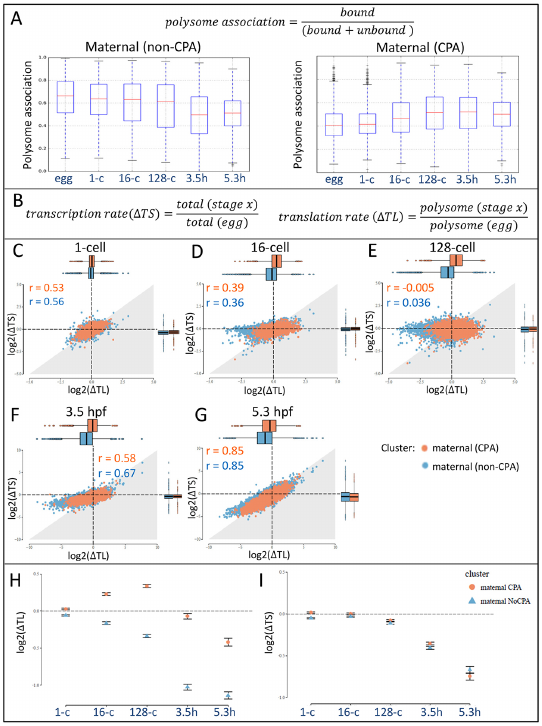

```{r setup, include = FALSE}
knitr::opts_chunk$set(
  collapse = TRUE,
  comment = "#>"
)
```


<center>

</center>


**Figure 2.** published in [*Cytoplasmic polyadenylation-mediated translational control of maternal mRNAs directs maternal to zygotic transition*](http://dev.biologists.org/content/early/2017/12/08/dev.159566) Winata CL, Łapiński M et al., Development, 11 December 2017. 


Interactive plot recreated in Shiny.

### Functions

Two functions are defined as follows. One for calculating the rate of transcription and translation. And second used for plotting.

### Data

The dataset contains the read counts and FPKM values for the conducted experiments. The gene expression was quantified using Salmon[[1](https://combine-lab.github.io/salmon/)], imported to R using tximport[[2](https://github.com/mikelove/tximport)] and normalized with DESeq2[[3](https://bioconductor.org/packages/release/bioc/html/DESeq2.html)]. FPKM values were produced using DESeq2.

## Polysome association dynamics

Measurements of transcription (∆TS) and translation (∆TL) rates were obtained as a fraction of total and polysome-bound expression values at particular stages compared with the egg stage as baseline. Translational regulation is defined as a non-linear relationship  between  transcription and translation rates.

<center>
$transcription\ rate (∆TS)=\frac{total(stage\ x)}{total(egg)}$; $translation\ rate(∆TL)=\frac{polysome(stage\ x)}{polysome(egg)}$
</center>

---

### Examples

Run in the interactive session only
```{r examles, eval=FALSE}
if (interactive()) {
    runPlot()
}
```
